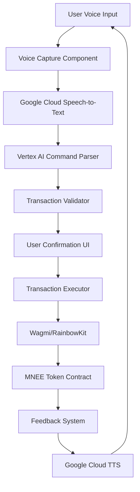

# Design Document: Voice-Controlled MNEE Token Transfer

## Overview

This feature extends the existing Kaseddie AI trading platform to support voice-controlled MNEE token transfers. Users will speak natural language commands (e.g., "Sauti, send 50 MNEE to John") which will be processed through a voice-to-text pipeline, parsed by AI to extract transaction parameters, and executed on-chain using the existing RainbowKit/Wagmi wallet infrastructure.

The system leverages existing components (Google Cloud Speech-to-Text, Vertex AI, RainbowKit/Wagmi) and adds new components for MNEE token interaction and voice command orchestration.

## Architecture

### High-Level Architecture



### Component Layers

1. **Presentation Layer** (Frontend)
   - Voice input capture component
   - Transaction confirmation modal
   - Status feedback display
   - Wallet connection status indicator

2. **Application Layer** (Backend)
   - Voice-to-text service (Google Cloud Speech-to-Text)
   - AI command parser (Vertex AI)
   - Transaction validation service
   - MNEE contract interaction service

3. **Integration Layer**
   - RainbowKit/Wagmi wallet connector
   - MNEE ERC-20 contract interface
   - Google Cloud services integration

## Components and Interfaces

### 1. Voice Input Component (Frontend)

**Location**: `frontend/src/components/VoiceTransfer.jsx`

**Responsibilities**:
- Capture audio input from user's microphone
- Display recording status and waveform visualization
- Send audio to backend for processing
- Display parsed command for user confirmation

**Interface**:
```typescript
interface VoiceTransferProps {
  onTransactionComplete: (txHash: string) => void;
}

interface VoiceState {
  isRecording: boolean;
  isProcessing: boolean;
  audioBlob: Blob | null;
  transcribedText: string;
  parsedCommand: ParsedCommand | null;
}
```

### 2. Speech-to-Text Service (Backend)

**Location**: `backend/src/services/speechService.js`

**Responsibilities**:
- Convert audio to text using Google Cloud Speech-to-Text
- Handle audio format conversion
- Manage API credentials and rate limiting

**Interface**:
```javascript
/**
 * Convert audio to text
 * @param {Buffer} audioBuffer - Audio data
 * @returns {Promise<string>} Transcribed text
 */
async function transcribeAudio(audioBuffer)

/**
 * Validate audio quality
 * @param {Buffer} audioBuffer - Audio data
 * @returns {Promise<boolean>} True if quality is sufficient
 */
async function validateAudioQuality(audioBuffer)
```

### 3. AI Command Parser Service (Backend)

**Location**: `backend/src/services/commandParserService.js`

**Responsibilities**:
- Parse natural language commands using Vertex AI
- Extract action, amount, and recipient
- Resolve recipient identifiers (ENS names, nicknames)
- Validate parsed data

**Interface**:
```javascript
/**
 * Parse voice command
 * @param {string} text - Transcribed command
 * @returns {Promise<ParsedCommand>} Structured command data
 */
async function parseVoiceCommand(text)

interface ParsedCommand {
  action: 'transfer';
  amount: number;
  recipient: string; // Ethereum address
  confidence: number; // 0-100
  rawText: string;
}
```

### 4. MNEE Token Service (Backend)

**Location**: `backend/src/services/mneeService.js`

**Responsibilities**:
- Read MNEE token balance
- Prepare transfer transaction data
- Validate sufficient balance
- Interact with MNEE contract

**Interface**:
```javascript
/**
 * Get MNEE balance for address
 * @param {string} address - Wallet address
 * @returns {Promise<string>} Balance in MNEE
 */
async function getMNEEBalance(address)

/**
 * Prepare transfer transaction
 * @param {string} to - Recipient address
 * @param {string} amount - Amount in MNEE
 * @returns {Promise<TransactionData>} Transaction data for signing
 */
async function prepareTransfer(to, amount)
```

### 5. Transaction Executor (Frontend)

**Location**: `frontend/src/services/transactionService.js`

**Responsibilities**:
- Execute transactions using Wagmi
- Monitor transaction status
- Handle transaction errors
- Update UI with transaction progress

**Interface**:
```typescript
/**
 * Execute MNEE transfer
 * @param to - Recipient address
 * @param amount - Amount in MNEE
 * @returns Transaction hash
 */
async function executeMNEETransfer(
  to: string, 
  amount: string
): Promise<string>
```

## Data Models

### ParsedCommand
```typescript
interface ParsedCommand {
  action: 'transfer';
  amount: number;
  recipient: string;
  confidence: number;
  rawText: string;
  timestamp: string;
}
```

### TransactionStatus
```typescript
type TransactionStatus = 
  | 'idle'
  | 'recording'
  | 'transcribing'
  | 'parsing'
  | 'confirming'
  | 'executing'
  | 'pending'
  | 'confirmed'
  | 'failed';

interface TransactionState {
  status: TransactionStatus;
  txHash?: string;
  error?: string;
  parsedCommand?: ParsedCommand;
}
```

### MNEE Contract Interface
```typescript
interface MNEEContract {
  address: '0x8c...'; // Full address to be provided
  abi: [...]; // ERC-20 ABI
  functions: {
    balanceOf(address: string): Promise<BigNumber>;
    transfer(to: string, amount: BigNumber): Promise<Transaction>;
  }
}
```


## Correctness Properties

*A property is a characteristic or behavior that should hold true across all valid executions of a system-essentially, a formal statement about what the system should do. Properties serve as the bridge between human-readable specifications and machine-verifiable correctness guarantees.*

### Property 1: Wallet status verification on initialization

*For any* system initialization, the wallet connectivity status check should return a valid status (connected or disconnected) without errors.

**Validates: Requirements 1.1**

### Property 2: Wallet state change reactivity

*For any* wallet state change event, the system status should update to reflect the new wallet state within a defined time threshold.

**Validates: Requirements 1.4**

### Property 3: Balance read accuracy

*For any* connected wallet address, reading the MNEE balance should return the same value as directly querying the MNEE contract at address 0x8c...

**Validates: Requirements 2.1**

### Property 4: Balance refresh after transaction

*For any* completed transaction, the displayed MNEE balance should be refreshed and reflect the new balance from the contract.

**Validates: Requirements 2.4**

### Property 5: Audio capture validity

*For any* audio capture operation, the captured audio data should be in a valid format (non-empty, correct encoding) suitable for speech-to-text processing.

**Validates: Requirements 3.1**

### Property 6: Speech-to-text conversion

*For any* valid audio input, the speech-to-text service should return a non-empty text string.

**Validates: Requirements 3.2**

### Property 7: Text forwarding to parser

*For any* successfully transcribed text, the text should be forwarded to the AI Parser without modification.

**Validates: Requirements 3.4**

### Property 8: Action extraction from commands

*For any* command text containing transfer-related keywords (send, transfer, pay), the AI Parser should extract "transfer" as the action type.

**Validates: Requirements 4.1**

### Property 9: Amount extraction from commands

*For any* command text containing a numeric amount (in digits or words), the AI Parser should extract the correct numeric value.

**Validates: Requirements 4.2**

### Property 10: Recipient address resolution

*For any* command text containing a recipient identifier (Ethereum address, ENS name), the AI Parser should resolve it to a valid Ethereum address format (0x...).

**Validates: Requirements 4.3**

### Property 11: Parser output structure

*For any* successfully parsed command, the output should contain all required fields: action (string), amount (number), recipient (string), and confidence (number 0-100).

**Validates: Requirements 4.4**

### Property 12: Parser error handling

*For any* unparseable command (missing amount or recipient), the AI Parser should return an error object with a descriptive message indicating which field is missing.

**Validates: Requirements 4.5**

### Property 13: Confirmation triggers execution

*For any* confirmed parsed command, the system should proceed to transaction execution by calling the transaction executor with the parsed parameters.

**Validates: Requirements 5.2**

### Property 14: Rejection cancels transaction

*For any* rejected parsed command, the system should cancel the transaction, reset the state to idle, and not execute any blockchain transaction.

**Validates: Requirements 5.3**

### Property 15: Insufficient balance validation

*For any* parsed command where the amount exceeds the user's MNEE balance, the system should return a validation error before reaching the confirmation stage.

**Validates: Requirements 5.4**

### Property 16: Transaction execution with correct parameters

*For any* confirmed transaction, the MNEE contract transfer function should be called with the exact recipient address and amount from the parsed command.

**Validates: Requirements 6.1**

### Property 17: Wallet disconnection halts operations

*For any* in-progress operation, if the wallet connection is lost, the system should immediately halt the operation and transition to a disconnected state.

**Validates: Requirements 8.2**

### Property 18: Ambiguous command handling

*For any* command with ambiguous parameters (e.g., multiple possible recipients, unclear amount), the AI Parser should return a clarification request rather than guessing.

**Validates: Requirements 8.3**

### Property 19: Contract interaction error handling

*For any* MNEE contract interaction that fails (network error, contract revert), the system should catch the error, log it, and return a user-friendly error message without crashing.

**Validates: Requirements 8.4**

## Error Handling

### Error Categories

1. **Voice Input Errors**
   - Microphone access denied
   - Audio quality too low
   - Speech-to-text API failure
   - No speech detected

2. **Parsing Errors**
   - Ambiguous command
   - Missing required parameters (amount or recipient)
   - Invalid recipient format
   - AI service unavailable

3. **Validation Errors**
   - Insufficient MNEE balance
   - Invalid recipient address
   - Amount too small (below minimum)
   - Amount exceeds maximum transfer limit

4. **Transaction Errors**
   - Wallet not connected
   - User rejected transaction
   - Insufficient gas
   - Contract execution failed
   - Network timeout

5. **System Errors**
   - Backend service unavailable
   - Rate limit exceeded
   - Invalid configuration

### Error Handling Strategy

- All errors should be caught and logged with context
- User-facing error messages should be clear and actionable
- System should gracefully degrade (e.g., retry with exponential backoff)
- Critical errors should reset the system to a safe state
- All errors should include a unique error code for debugging

### Error Recovery

- Voice input errors: Prompt user to try again
- Parsing errors: Request clarification or suggest corrections
- Validation errors: Display specific issue and suggest fix
- Transaction errors: Offer retry option with same parameters
- System errors: Display maintenance message and log for investigation

## Testing Strategy

### Unit Testing

Unit tests will verify specific examples and edge cases:

- Voice capture with various audio formats
- Speech-to-text with different accents and speech patterns
- AI parser with edge case commands (very large amounts, special characters)
- Balance validation with boundary values (zero, maximum uint256)
- Transaction execution with mock wallet responses
- Error handling for each error category

### Property-Based Testing

Property-based tests will verify universal properties across all inputs:

- **Testing Framework**: fast-check (JavaScript property-based testing library)
- **Minimum Iterations**: 100 runs per property test
- **Tagging Convention**: Each property test must include a comment with format:
  `// Feature: voice-mnee-transfer, Property {number}: {property_text}`

Property tests will cover:

1. Parser output structure validation across random command variations
2. Balance validation logic with random amounts and balances
3. Address resolution with random valid/invalid addresses
4. Transaction parameter passing with random valid inputs
5. Error handling with random invalid inputs
6. State transitions with random event sequences

### Integration Testing

Integration tests will verify component interactions:

- End-to-end voice command flow (voice → text → parse → execute)
- Wallet connection state management
- MNEE contract interaction
- Error propagation through the system
- UI state updates based on backend responses

### Manual Testing Scenarios

1. Happy path: "Send 50 MNEE to 0x123..."
2. Natural language variations: "Transfer fifty MNEE tokens to Alice"
3. Error scenarios: Insufficient balance, invalid address, network failure
4. Edge cases: Very large amounts, very small amounts, special characters
5. Wallet disconnection during various stages
6. Multiple rapid commands (stress testing)

## Security Considerations

### Input Validation

- All voice commands must be sanitized before AI processing
- Recipient addresses must be validated as proper Ethereum addresses
- Amounts must be validated as positive numbers within safe ranges
- Rate limiting on voice command submissions to prevent abuse

### Transaction Security

- All transactions require explicit user confirmation
- Transaction parameters displayed clearly before execution
- Wallet signatures required for all on-chain operations
- No private keys or sensitive data stored in frontend
- All backend API calls authenticated and rate-limited

### Data Privacy

- Audio data not stored permanently
- Voice commands logged without PII
- Transaction history encrypted at rest
- Compliance with data protection regulations

## Performance Requirements

- Voice-to-text latency: < 3 seconds
- AI parsing latency: < 2 seconds
- Balance read latency: < 1 second
- Transaction submission: < 5 seconds
- Total end-to-end flow: < 15 seconds
- UI should remain responsive during all operations
- Support for concurrent users without degradation

## Deployment Considerations

### Frontend Deployment

- Deploy to existing Netlify infrastructure
- Environment variables for MNEE contract address
- Feature flag for gradual rollout
- Analytics tracking for voice command usage

### Backend Deployment

- Deploy to existing Render infrastructure
- Google Cloud credentials for Speech-to-Text
- Vertex AI configuration for command parsing
- Health check endpoints for monitoring
- Logging and error tracking integration

### Configuration

Required environment variables:
- `MNEE_CONTRACT_ADDRESS`: MNEE token contract address
- `GOOGLE_APPLICATION_CREDENTIALS`: Path to Google Cloud credentials
- `GOOGLE_PROJECT_ID`: Google Cloud project ID
- `VERTEX_AI_LOCATION`: Vertex AI region (us-central1)
- `SPEECH_TO_TEXT_LANGUAGE`: Language code (en-US)

## Future Enhancements

1. **Multi-language Support**: Support for languages beyond English
2. **Voice Biometrics**: Voice authentication for added security
3. **Batch Transfers**: "Send 10 MNEE to Alice, Bob, and Charlie"
4. **Scheduled Transfers**: "Send 50 MNEE to Alice tomorrow"
5. **Voice Feedback**: Speak transaction status updates
6. **Contact Management**: Save recipient nicknames for easier commands
7. **Transaction History**: Voice query for past transactions
8. **Price Queries**: "What's the price of MNEE?"
